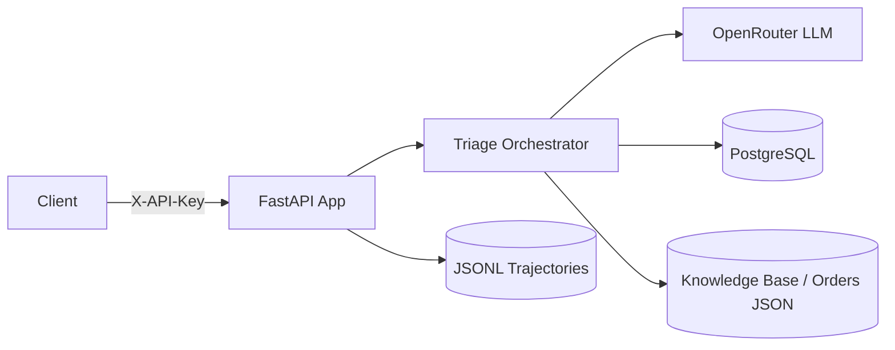
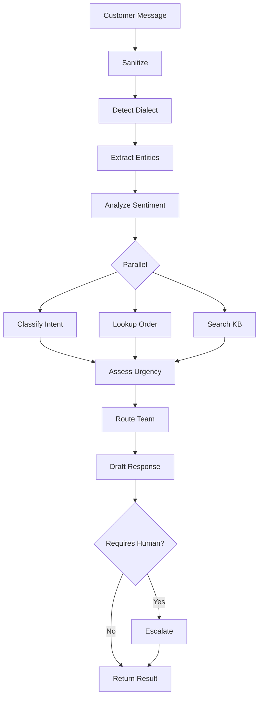
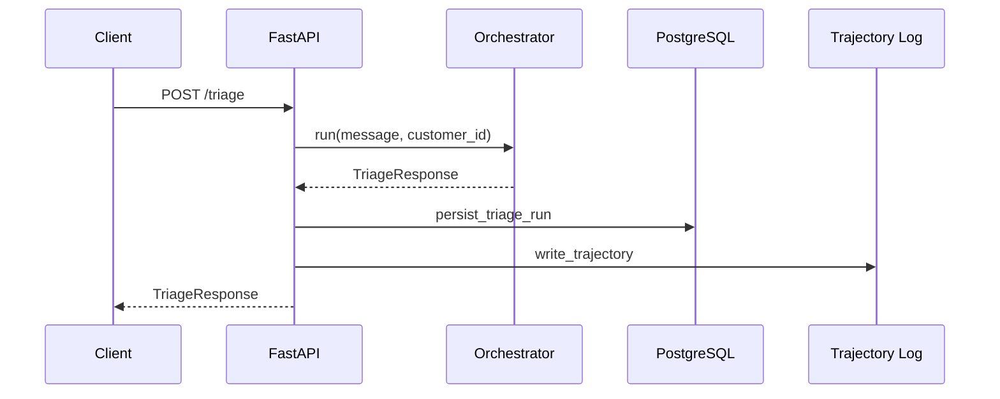

# Arabic Customer Support Agent

A raw tool-calling triage agent for Arabic-language e-commerce customer
support, built with FastAPI, SQLAlchemy/PostgreSQL, and the OpenRouter API
(Qwen ). 

## Architecture

```
agent/
  orchestrator.py   # sequential tool-calling pipeline
  models.py         # pydantic request/response models
  nlp/              # sanitizer, dialect detector, sentiment, entities, urgency
  tools/            # classify_intent, lookup_order, search_kb,
                     # draft_response, route_team, escalate
api/                # FastAPI app, routes, schemas
database/           # SQLAlchemy models, postgres session, schema.sql
llm/                # OpenRouter client + prompt templates
observability/      # JSON logging, JSONL trajectories, DB persistence
evaluation/         # metrics, routing accuracy, LLM judge, error analysis
scripts/            # seed_db, sample_dataset, run_demo
data/               # orders, knowledge base, taxonomies, test sets
tests/              # pytest unit/integration tests
```

## System Design



## Triage Pipeline



## Request Flow



## Setup (WSL Ubuntu + Conda)

```bash
conda create -n arabic-agent python=3.11 -y
conda activate arabic-agent
cd /mnt/c/Users/FreeComp/Arabic-customer-support-agent-
pip install -r requirements.txt
cp .env.example .env   # then fill in OPENROUTER_API_KEY and DATABASE_URL
```

## Setup (Docker)

A one-command setup is available via Docker Compose. It starts a PostgreSQL
container, initializes the schema, seeds sample orders, and runs the API.

```bash
cp .env.example .env   # fill in OPENROUTER_API_KEY (and optionally API_KEY)
docker compose up --build
```

The API will be available at `http://localhost:8000`.

## Database

Requires a running PostgreSQL instance matching `DATABASE_URL`.

```bash
python -m scripts.seed_db
```

This creates the `orders`, `triage_runs`, and `escalations` tables (see
`database/schema.sql`) and seeds sample orders from `data/orders.json`.

## Authentication & Rate Limiting

If `API_KEY` is set in `.env`, all endpoints except `/health` require an
`X-API-Key` header matching that value:

```bash
curl -H "X-API-Key: <your-key>" http://localhost:8000/runs
```

If `API_KEY` is left empty, authentication is disabled (a warning is logged
at startup). All endpoints are also rate-limited to `RATE_LIMIT_PER_MINUTE`
requests per minute per client IP (default: 30).

## Running the API

```bash
uvicorn api.main:app --reload
```

Endpoints:

- `POST /triage` — run the full triage pipeline on a customer message
- `GET /health` — health check (no auth required)
- `GET /runs` — list recent triage runs

Cases that `requires_human` are also persisted to the `escalations` table for
follow-up by a human agent.

## Pipeline

```
message -> sanitizer -> dialect detection -> entity extraction -> sentiment
        -> classify intent -> lookup order -> search kb -> assess urgency
        -> route team -> draft response -> optional escalation -> triage record
```

Every run produces a JSONL trajectory under `logs/trajectories/{run_id}.jsonl`
and a row in `triage_runs`.

## Evaluation

```bash
python -m scripts.sample_dataset   # merges labeled test sets into gold_test.csv
python -m evaluation.run_eval      # computes precision/recall/F1 + routing accuracy
```

This also runs every case in `data/knowledge_base/test_set/adversarial_cases.json`
and `hotel_adversarial_cases.json` through the orchestrator (prompt-injection,
edge cases, etc.) and writes a qualitative report for manual review.

Reports are written to `logs/evaluations/`:

- `evaluation_report.json` — intent metrics, routing accuracy, per-case
  results, and adversarial results
- `error_report.json` — misclassified cases
- `adversarial_report.json` — adversarial case outputs

## Tests

```bash
pytest -q
```

## CI

GitHub Actions (`.github/workflows/ci.yml`) runs `pytest -q` against a
PostgreSQL service container on every push/PR to `main`.
